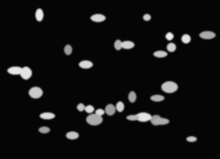
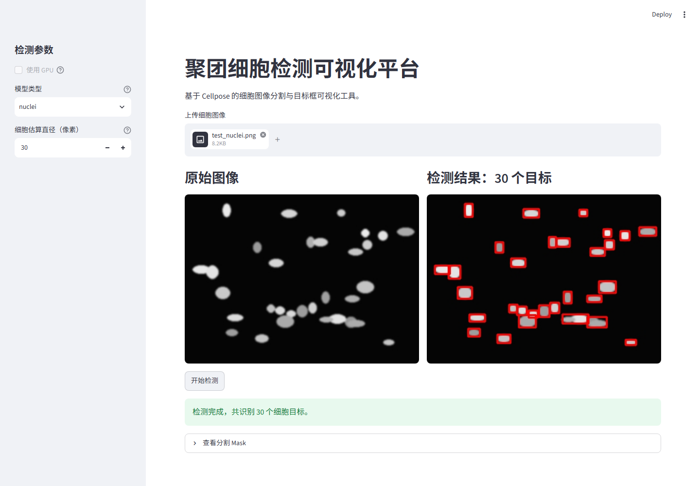

# Cell Cluster Detector

基于 Streamlit 和 Cellpose 的聚团细胞检测可视化平台。

项目支持上传显微镜细胞图像，自动完成细胞区域分割，并在原图上绘制目标框，适合用于课程项目、实验演示和简历作品展示。

## 效果预览

测试图：



运行结果：



## 功能

- 上传 `png`、`jpg`、`jpeg`、`tif`、`tiff` 格式图像
- 支持 Cellpose 的 `cyto`、`nuclei`、`cyto3` 模型
- 可手动设置细胞估算直径
- 输出细胞检测数量、目标框结果图和分割 Mask

## 运行方法

安装依赖：

```bash
pip install -r requirements.txt
```

启动应用：

```bash
streamlit run app.py
```

浏览器打开 Streamlit 自动给出的本地地址，即可上传图片并查看检测结果。

## 文件说明

```text
app.py              主程序
requirements.txt    运行依赖
docs/images/        项目效果图
```
